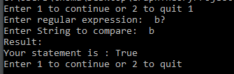
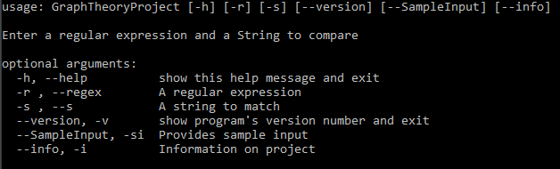

# `Graph Theory Project Overview`
Explanation of Project work for the Graph Theory Project

## `Introduction`
For this project we were tasked with writing a program in python to execute regular expressions on strings using an algorithm known as Thompson's Contruction.
Using this algorithm we build a non-deterministic finite automaton (NFA) from a regular expression, and can use the NFA to check if the regular expression matches any given string of text.
In my repository it includes a python file called GraphTheoryProject.py, this includes the code for the main project. There is also another file that takes in two text files and compares them using the algorithm. These are located in the folder called PythonFiles. There is Research document included in the Repository, this shows the research I did for the project. In the main python file there is a command line included if you require help with the project, I will go into detail about this command line further on. There is also various tests I used in the main project file. I will explain these tests in the "Test" section.

## `Run`

### Download Project
* To run this code first you need to download it.<br> 
* To do this create a folder on your computer. 
* Go to the command line and cd into the folder just created for example "cd Desktop/FolderName". 
* Once this is done use the command "Git clone url" the url should be given on the frontpage of the repository. 
* If this is done succesfully the project should be downloaded in the file you just created.
* To Run the Python file you need to have Python 3 installed on your machine. <br>
  If you don't have Python installed follow the steps shown here.

### Installing Python
 
* To install Python navigate to the page https://www.python.org/ .<br>
* Once on this page go to the download section. <br>
* Choose version e.g Windows, Linux <br>
* Once the installer is downloaded run and wait for it to be installed. <br>

### Running the Programme
* Once Python is installed cd into Python files.<br>
* Run the command Python GraphTheoryProject.py. This will run the programme.<br>
* Next you should see an option to continue or quit. <br>
* Type 1 to continue or 2 to quit.<br>
* Enter in a Regular expression e.g "b?" <br>
* Next, enter in a string to compare eg "b" <br>
* Result should be as shown <br>



If you want to use the command line use the following Python GraphTheoryProject.py --help  . <br>
This will display help if you require. As shown here.<br>
<br>


### Command line
To implement the command line I used argpare. <br>
I wasn't too familiar with argparse so I had to do research into it , I will reference the website I used in the references section.<br>
I used the following code to implement the command line <br>
```python
parser = argparse.ArgumentParser(description='Enter a regular expression and  a String to compare' , prog='GraphTheoryProject')
parser.add_argument('-r', '--regex' , type=str  , metavar='' ,help='A regular expression')
parser.add_argument('-s', '--s', type=str, metavar='' , help='A string to match')
parser.add_argument('--version', '-v',  action='version', version='%(prog)s 2.0')
parser.add_argument('--SampleInput', '-si', help='Provides sample input',  action='version', version='Regular expression = b*  | String = bbbbbb  | Result = True')
parser.add_argument('--info' , '-i', action='version',version='*Thompsons Alogorithm* is a method of transforming a regular expression into an equivalent nondeterministic finite automaton (NFA) , This NFA can be used to match strings against the regular expression.'  ,  help='Information on project')
args = parser.parse_args()

if any(vars(args).values()):
    print("Result:")
    print("Your statement is :" , match(args.regex, args.s))

elif not any(vars(args).values()):
    Menu(self=Menu)
```
* The user can see what the variables mean like regex and s.
* Version shows the current version of the project.
* Sample input gives you input to test the project if you are not sure what to enter.
* Info gives you a background to the project
* If none of these arguments are called when they run "Python GraphTheoryProject.py --help " for example, they will be brought to the menu.


## `Test`
* In the menu you will see an option to run tests.
* Type 3 to run the test.
* If there is an error in the test it will display saying which test had the error.
* If all tests pass you will see a message saying "Tests finished with zero erros"

```python 
        
        print("Tests finished with zero errors")
        print("")
        Menu(self=Menu)
```
* You will then return to the menu <br>
  These tests were made using Python assert. <br>
  Assert is used for debugging that tests a condition , if the condition is true the project continues as normal <br>
  If the value is false it ouputs the error.<br>
  These are the following tests included with the project
  ```python 
     tests = [
            ["b*","bbbbbbbbb",  True],
            ["b+" , "b" , True],
            ["b+" ,"  " , False],
            ["b?","b" , True],
            ["b.b|b","b",  True]
        ]
        ```
  
  
  
## `Algorithm`
### Shunting-yard Algorithm
  This algorithm is used for changing the expression from infix to postfix notation. (Also known as Reverse Polish Notation)
  Invented by Edsger Dijkstra <br>
  This is achieved by doing the following steps
* Firstly we take in a regular expression
* We then put it into a list and using the following code [::-1] to reverse the list.
* Once the list if reversed we pass it through a while loop to decide what do with, taking in account of the precedence.

```python
infix = list(infix)[::-1] 

    OperatorStack  = [] 

    postfix = [] 
    prec = {     #operator precedence
    '*': 100,
    '+': 95,
    '?': 90,
    '.': 80, 
    '|': 60,
    ')': 40, 
    '(': 20}
   ``` 
    
    
* In the project we create a Operator Stack.
* Depending on the characters we add or pop from the stack until we are left with the expression in postfix notation.

We use the following code to achive this


 ```python
 while infix:   
        c = infix.pop()
        if c == '(':   
            OperatorStack.append(c)
        elif c == ')':
            while OperatorStack [-1] != '(':
                postfix.append(OperatorStack.pop())
            OperatorStack .pop()
        elif c in prec:
            while OperatorStack  and prec[c] < prec[OperatorStack [-1]]:
                postfix.append(OperatorStack.pop())
            OperatorStack .append(c)
        else:
            postfix.append(c)
    while OperatorStack :
        postfix.append(OperatorStack.pop())
    return ''.join(postfix)
```
### Thompson's Contruction Algorithm
This is a algorithm used for transforming a regular expression into a nondeterministic finite automaton (NFA). For this project we used this algorithm to match strings to a regular expression.<br>
Credited to Ken Thompson.<br>
We can perform this algorithm by doing the following steps.
* First we will take in our expression that has passed through the shunting-yard algorithm.
```python
    postfix = shunt(infix)
    postfix = list(postfix)[::-1]
  ```
    
* Next we will create a nfa Stack.
* Once this is done we will loop the postfix list and pop fragments of the list and add them to the stack.
* We will perform different operations depending on the character.
### The "." operator
```python
   if c == '.':  #any character accepted
            frag1 = nfa_stack.pop()   #create two fragments
            frag2 = nfa_stack.pop()
            frag2.accept.edges.append(frag1.start)
            newfrag = Fragment(frag2.start, frag1.accept) #create new instance of fragment to represent the nfa
            nfa_stack.append(newfrag)
  ```
 ### The "|" operator
 ```python
 elif c == '|':    # 0 or 1
            frag1 = nfa_stack.pop() #create two fragements as in can be 0 or 1 
            frag2 = nfa_stack.pop()
            accept = State()
            start = State(edges=[frag2.start, frag1.start])
            frag1.accept.edges.append(accept)
            frag2.accept.edges.append(accept)
            newfrag = Fragment(start, accept) #create new instance of fragment to represent the nfa
            nfa_stack.append(newfrag)
 ```
 ### The "*" operator 
 ```python
  elif c == '*':    # 0 or more
            frag = nfa_stack.pop()  # one fragment it created
            accept = State()
            start = State(edges=[frag.start, accept])
            frag.accept.edges = ([frag.start, accept])
            newfrag = Fragment(start, accept) #create new instance of fragment to represent the nfa
  ```
  
  ### The "+" operator.
  ```python
    elif c == '+':  # 1 or more
            frag = nfa_stack.pop() # one fragment created
            frag.accept.edges.append(frag.start)
            newfrag = Fragment(frag.start, frag.accept) #create new instance of fragment to represent the nfa
  ```
  ### The "?" operator
  ```python
     elif c == '?':  # 0 or 1
            frag = nfa_stack.pop() # one fragment created
            accept = State()
            start = State(edges=[frag.start, accept])
            frag.accept.edges = ([accept])
            newfrag = Fragment(start, accept) #create new instance of fragment to represent the nfa
 ```
 * If it is not one of the special characters we will perform this operation
 ```python
 else:
            accept = State()
            initial = State(label=c, edges=[accept])
            newfrag = Fragment(initial, accept)
  ```
  * After each operation we push the new nfa instance of fragment to represent the new nfa.
  ```python
   nfa_stack.append(newfrag)
   ```
   
  * Once we have the nfa created we can perform a match against the string.
  ```python
  def match(regex, s):  # match the regular expression with a string

    nfa = compile(regex)

    current = set()
    followes(nfa.start, current)
    previous = set()
    for c in s:    #loop through characters in s
        previous = current
        current = set()  #create new empty set

        for state in previous:
            if state.label is not None:
                if state.label == c:
                    followes(state.edges[0], current) #add the state at the end of the arrow to current

    return nfa.accept in current    #see if it matches the string 
```
  
  
        
              
## `References`
   GMIT lecture videos <br>
   These videos were used to help construct the project.
 
   Regular expression cheat sheet https://www.debuggex.com/cheatsheet/regex/python <br>
   I used this cheat sheet to understand the values of special characters like the ? and + <br>
   
   Argparse https://docs.python.org/3/howto/argparse.html<br>
   I used this tutorial to understand how to implement command line arguements <br> 
   
   Python https://www.python.org/<br>
   Python was the language we were required to make the project with
   
   


## `Author`
Thomas Kenny

